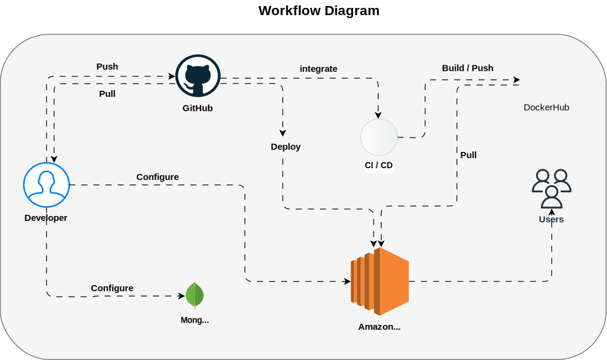

# Project Workflow & CI/CD Implementation

## Overview

This project automates the **build**, **test**, and **deployment** process for the **frontend** and **backend** applications using **CI/CD**, **Docker**, **Kubernetes**, and **AWS EC2**. It also includes **automated tests** and **notifications** to keep the team informed about the deployment success or failure.

<p align="center">
  
</p>

## Steps Taken:

### 1. Dockerized the Application

- **Created Dockerfiles** for both **frontend** and **backend** to containerize the services for consistent development and production environments.

### 2. Kubernetes Deployment

- Created **`deployment.yml`** and **`service.yml`** files for both **frontend** and **backend** applications.
- The services are exposed using **NodePort** to make them accessible externally.

### 3. CI/CD Pipeline

- **Triggered By**: Pushes to the `main` branch or pull requests targeting `main`.

#### Job 1 - Build & Push Docker Images

- Builds and pushes the **frontend** and **backend** Docker images to **Docker Hub**.
- Tags the images with `latest` and versioned tags for consistency.

#### Job 2 - Deploy to EC2

- SSHs into an **AWS EC2** instance.
- Pulls the latest Docker images.
- Deploys the applications to a **Kubernetes** cluster on EC2.

### 4. Automated Tests

- For pull requests, the pipeline builds the images and can be extended to run **automated tests** (unit or integration tests for both frontend and backend).

### 5. Notifications

- **Slack Notifications**: Sends real-time updates about build/deployment success or failure.

### 6. Final Verification

- After deploying to Kubernetes, the pipeline verifies the **status of the pods** using `kubectl get pods` to ensure everything is running smoothly.

---

## Key Components:

- **GitHub Actions**: Automates the CI/CD pipeline.
- **Docker**: Containers for consistent development and production environments.
- **Kubernetes**: Manages deployment and scaling of the applications.
- **AWS EC2**: Hosts the Kubernetes cluster.
- **Slack**: Notifications to keep the team informed about pipeline status.

---

## CI/CD Pipeline Summary

1. **Push Code to GitHub**: Triggered by push or pull request.
2. **Build Docker Images**: Builds the images for both frontend and backend.
3. **Push Docker Images**: Images are pushed to **Docker Hub** for use in deployment.
4. **Deploy to EC2**: Deploys the built Docker images to a **Kubernetes** cluster on **AWS EC2**.
5. **Verify Deployment**: Verifies that the pods are running successfully in the Kubernetes cluster.
6. **Notifications**: Slack notifications sent about the deployment status.

---

## How to Use

1. **Clone the Repository**:

   ```bash
   git clone https://github.com/SandyN12058/Better-Assignment-Internshala.git

2. **Set GitHub Secrets**:

   - Add your Docker Hub credentials, EC2 SSH key, and Slack webhook URL to your GitHub Secrets.

3. **Push to Main Branch**:

   - After making code changes, push them to the main branch to trigger the CI/CD pipeline.

4. **Monitor Notifications**:

   - You will receive Slack notifications about the pipeline status.

